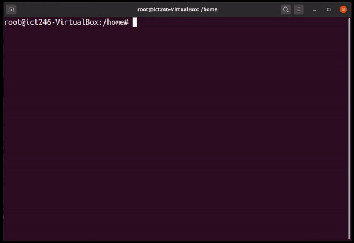

# Images File Permissions Inverter
This Bash script helps to identify images files in the current directory, display file permssions and allows users to invert specific file permissions.

## Functionalities
* Image File Identification

	+ Detects .png and .jpg files in the current directory

	+ Displays total image size and individual file sizes in bytes

* Permission Inverter

	+ Allows users to select a user type (owner, group, or others) and a file operation (read, write, or execute).

	+ Inverts the selected permission for all identified image files.

* System Feedback

	+ Displays current data and time

## Linux Environment
The script was developed in Ubuntu 22.04 LTS running on a 64-bit architecture, hosted within VirtualBox.

## Usage
1. Navigate to the directory containing your image files

2. Run the script:

```bash
bash /path/to/find_image.sh
```
3. Follow the on-screen prompts to invert permissions as desired

## Demo

